# Tree Cover Gain Analysis (2000-2020): A Geospatial Exploration

## Overview

This project aims to visualize and analyze global tree cover gain from 2000 to 2020, providing insights into forest dynamics and their environmental impacts. The relationship between forest cover and the theme of "Create a Data Science Workflow in the Metaverse of DePin: Tokeneconomy and Geospatial Analysis for Social Good and Sustainability" is rooted in the intersection of environmental data, decentralized technologies, and sustainable development.

- **Geospatial Analysis for Sustainability:** Forests play a critical role in carbon sequestration, biodiversity preservation, and ecosystem services, all of which are vital for sustainable development. By analyzing global tree cover gain, this project contributes to a better understanding of how natural resources are being managed and how their conservation can be optimized. This aligns with the broader goals of sustainability within decentralized initiatives.

- **DePin and Tokeneconomy:** Decentralized Physical Infrastructures (DePin) and tokeneconomies can incentivize and fund reforestation projects, conservation efforts, and sustainable land use practices. By leveraging blockchain technology and digital assets, these models can create transparent, verifiable, and scalable mechanisms for promoting environmental stewardship.

- **Metaverse and Social Good:** In the metaverse, geospatial data and virtual simulations can be used to raise awareness, educate, and engage communities in environmental conservation efforts. Virtual representations of forest cover data can serve as powerful tools in advocating for policies that promote sustainability and responsible land management.

This project leverages geospatial analysis to explore tree cover dynamics, which are directly relevant to sustainability goals. The integration of these insights into decentralized economies (DePin) and the metaverse creates opportunities for innovative solutions and broader public engagement in environmental conservation efforts.

  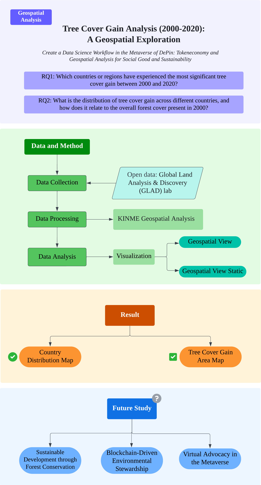

  <em>Figure 1: Flowchart of the project.</em>

## Data Description

### Meta Data Infomation
The dataset used in this study was developed by the Global Land Analysis & Discovery (GLAD) lab at the University of Maryland. It utilizes NASA GEDI lidar measurements and Landsat time-series data to assess global tree cover gain from 2000 to 2020. The data has a resolution of 30 × 30 meters, providing detailed information on a global scale.
Data Sources from Global Forest Watch: https://www.globalforestwatch.org/dashboards/global/

### Data Dictionary
| Variable Name | Description | Frecuency | Unit | Type |
| ------------- | ------------- | ------------- | ------------- | ------------- |
|  Region       | The name of the country or region. |     N/A    |     Text     |    String    |
|  iso          | ISO 3166-1 alpha-3 country code representing the region. |      N/A      |     N/A    |      String    |
|umd_tree_cover_gain__ha | Total area of tree cover gain from 2000 to 2020. |  2000-2020 (20 years cumulative)  | Hectares (ha) | Numeric|
|umd_tree_cover_extent_2000__ha|Total area of tree c000. | 2000 | Hectares (ha) |  Numeric|

### Citation
When using this data, please cite it as follows:
- Potapov, P., Hansen, M.C., Pickens, A., Hernandez-Serna, A., Tyukavina, A., Turubanova, S., Zalles, V., Li, X., Khan, A., Stolle, F., Harris, N., Song, X-P., Baggett, A., Kommareddy, I., and Kommareddy, A. 2022. The Global 2000-2020 Land Cover and Land Use Change Dataset Derived From the Landsat Archive: First Results. Frontiers in Remote Sensing, 13, April 2022. https://doi.org/10.3389/frsen.2022.856903

## KNIME Workflow
The geospatial analysis workflow for this project was built using KNIME (https://www.knime.com/), integrating the full process of data loading, processing, analysis, and visualization. 

  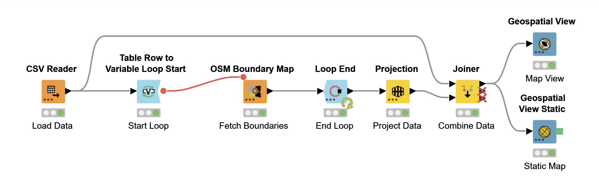

  <em>Figure 2: KINME Workflow Chart.</em>

### Step by Step Creation
- **Data Loading:** The tree cover gain data was downloaded from Global Forest Watch and imported into the KINME workflow.
  - **CSV Reader:** This node reads data from a CSV file and loads it into the KNIME platform. It's typically the first step in a workflow that involves data processing.

  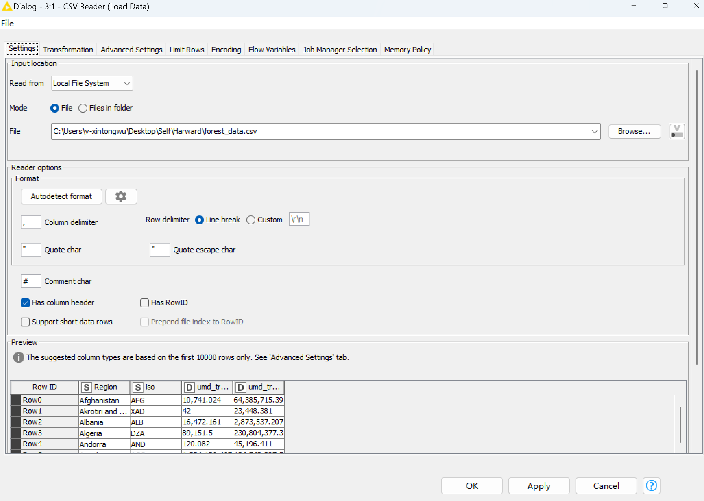

  <em>Figure 3: CSV Reader Settings.</em>

  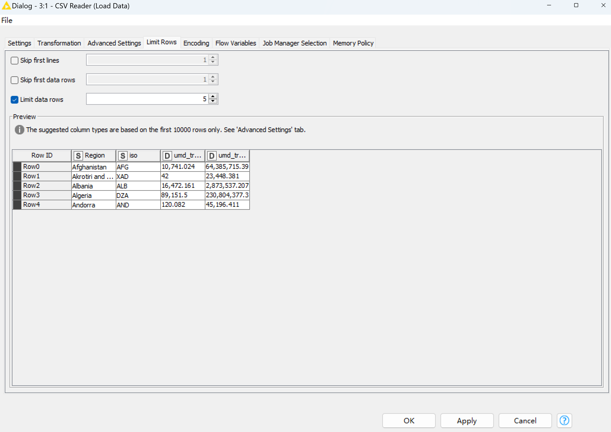

  <em>Figure 4: CSV Reader Settings (Limit Rows to Test).</em>

- **Data Processing:** Specific filtering and transformation operations were applied to the raw data to prepare it for analysis.
  - **Table Row to Variable Loop Start:** This node initiates a loop in the workflow. It converts each row of a table into a set of flow variables, allowing you to process each row separately in a loop.

  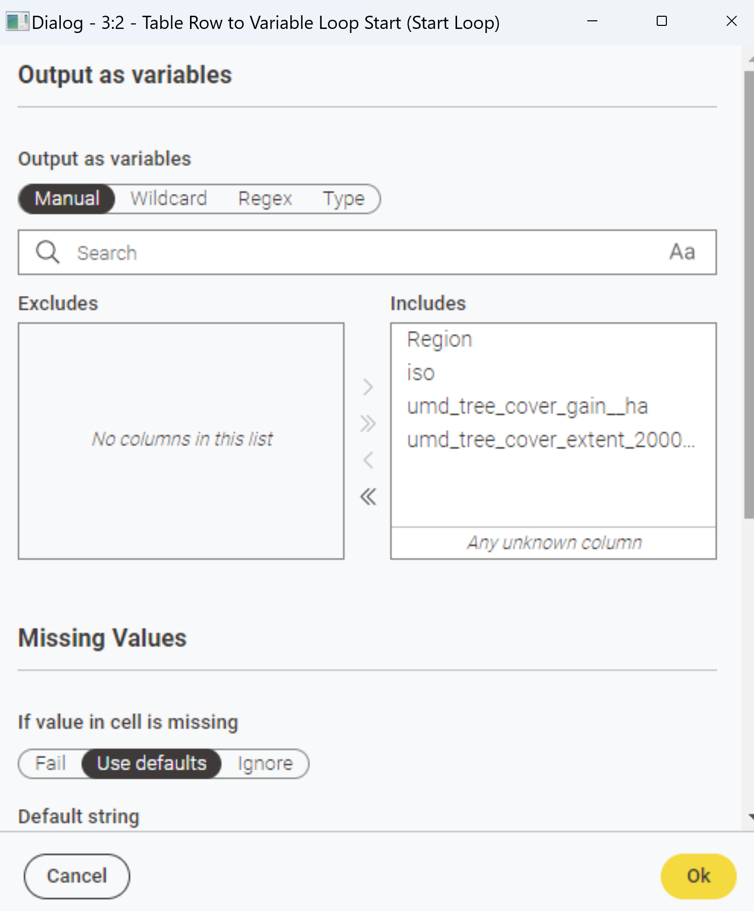

  <em>Figure 5: Table Row to Variable Loop Start Setting .</em>

  - **OSM Boundary Map:** This node retrieves boundary data (such as country or region borders) from OpenStreetMap (OSM). It's used to get geographical boundaries for further spatial analysis.

  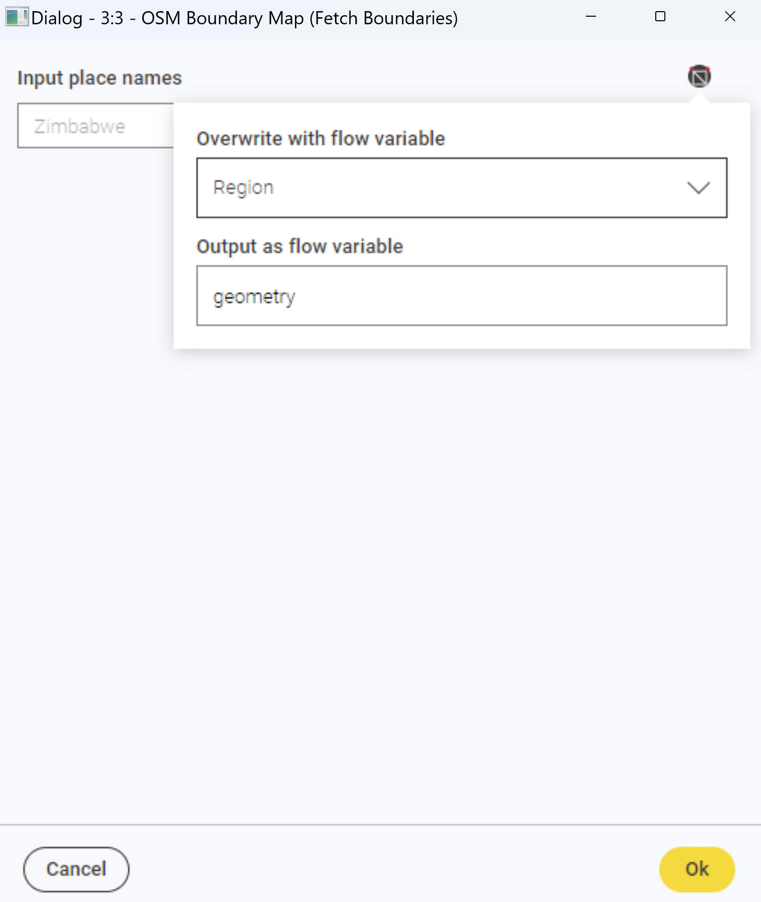

  <em>Figure 6: OSM Boundary Map Setting .</em>

    
  - **Loop End:** This node marks the end of the loop initiated by the "Table Row to Variable Loop Start" node. It collects the results of each iteration and outputs them as a single table.

  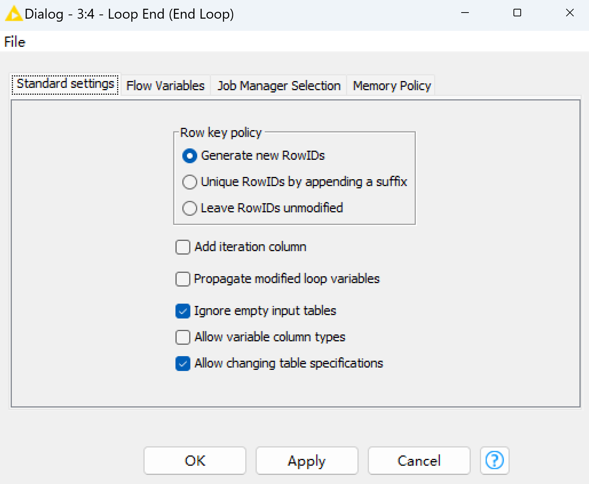

  <em>Figure 7: Loop End Setting .</em>

  - **Projection:** This node changes the coordinate system of the geospatial data. It is typically used to ensure that all spatial data uses a consistent coordinate system for analysis.

  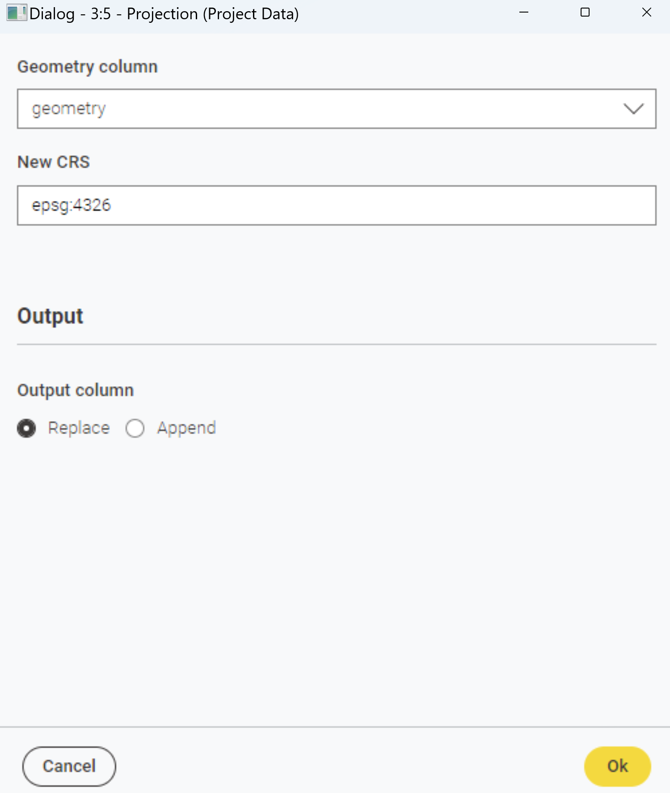

  <em>Figure 8: Projection Setting .</em>

  - **Joiner:** This node merges or joins two datasets based on a common key (like an ID or geographic coordinate). It's often used to combine geospatial data with other data types.

  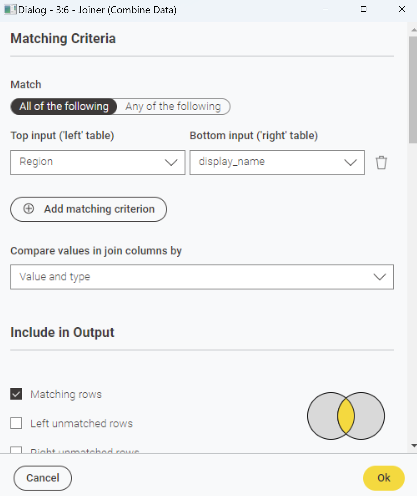

  <em>Figure 9: Joiner Setting (part1) .</em>

  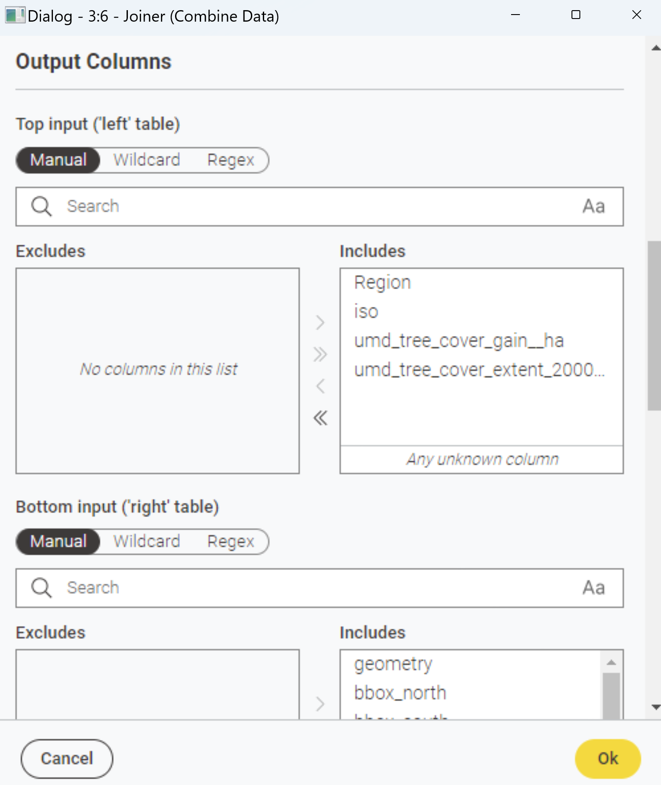

  <em>Figure 10: Joiner Setting (part2) .</em>

  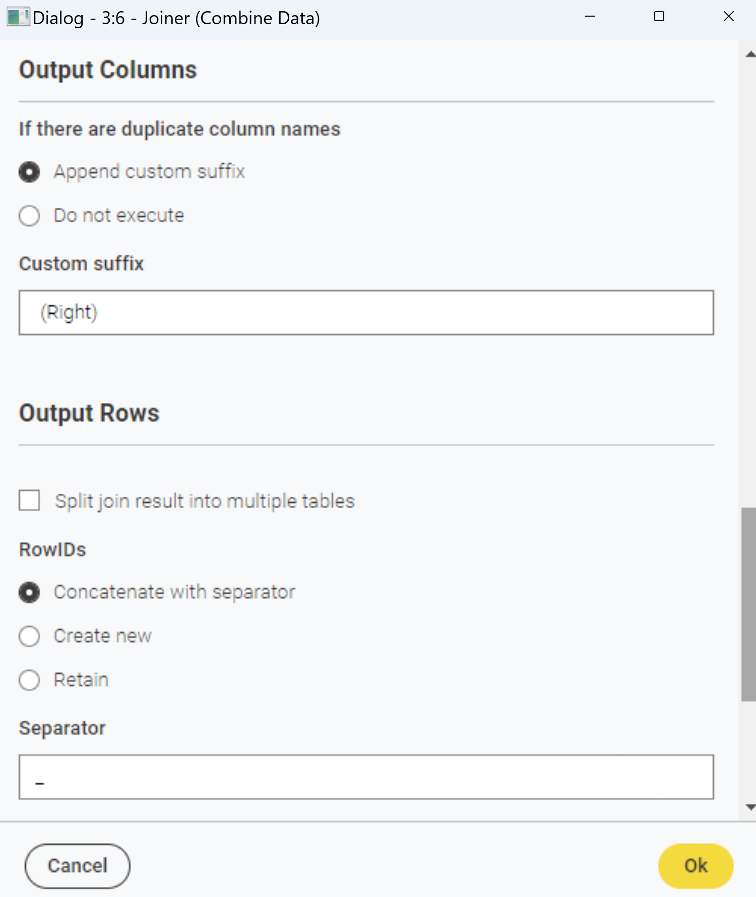

  <em>Figure 11: Joiner Setting (part3) .</em>

- **Visualization:** Maps were generated showing the distribution of countries and tree cover gain areas in hectares for each country.
  - **Geospatial View:** This node visualizes geospatial data on an interactive map. It allows you to explore and analyze spatial relationships visually.
  - **Geospatial View Static:** This node creates a static (non-interactive) map view of the geospatial data. It's useful for generating map images for reports or presentations.

  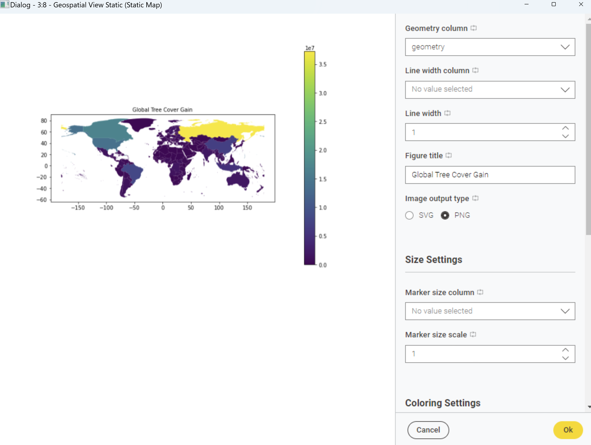

  <em>Figure 12: Geospatial View Static Setting (part1) .</em>

  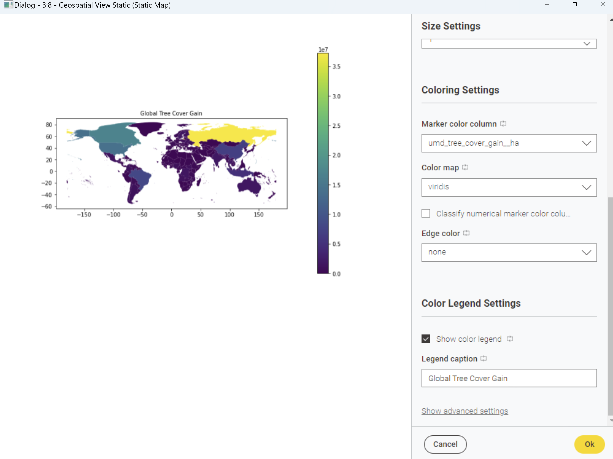

  <em>Figure 13: Geospatial View Static Setting (part2) .</em>

The workflow is available for download and reuse by the community at the following link: https://hub.knime.com/xintong/spaces/Public/geospatial_analysis~BieNOChHcBR6kQJO/current-state

### Insights

- **Country Distribution Map:**
Shows the countries included in the tree cover gain data

  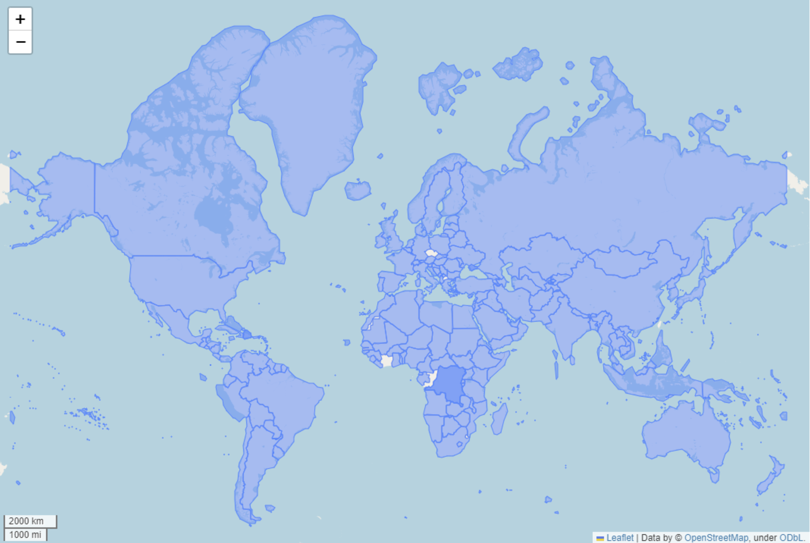

  <em>Figure 14: Countries/Areas Covered by the Data Set.</em>

- **Tree Cover Gain Area Map:** 
Displays the tree cover gain area (in hectares) for each country from 2000 to 2020.

  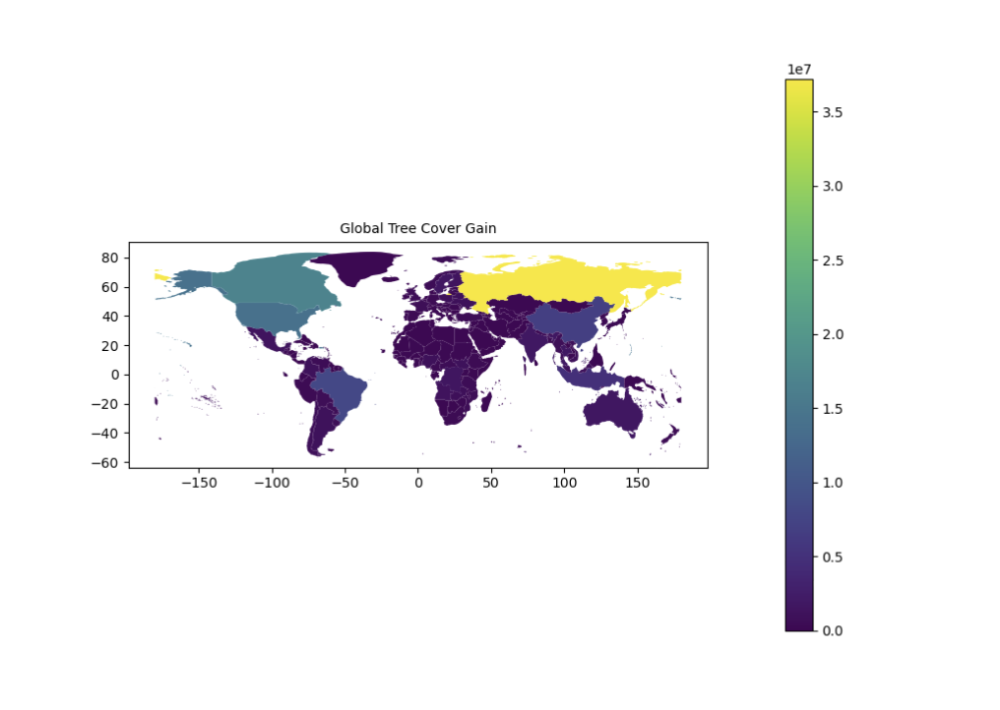

  <em>Figure 15: Global Tree Cover Gain Area.</em>

## Future Research Directions
This research can be further expanded to better serve the theme "Create a Data Science Workflow in the Metaverse of DePin: Tokeneconomy and Geospatial Analysis for Social Good and Sustainability." Potential directions include:
- **Integration with DePin Ecosystem:** Combine tree cover gain data with the tokenomics of the DePin platform to explore how blockchain technology can incentivize reforestation and forest conservation activities.
- **Quantitative Analysis for Social Good:** Use the data to assess the socio-economic impacts of forest recovery globally and regionally, exploring how decentralized platforms and the metaverse can achieve social good objectives.
- **Interdisciplinary Collaboration:** Collaborate with experts in environmental science, economics, sociology, and other fields to study the impact of different environmental governance policies on tree cover gain and how technology can support sustainable development.

